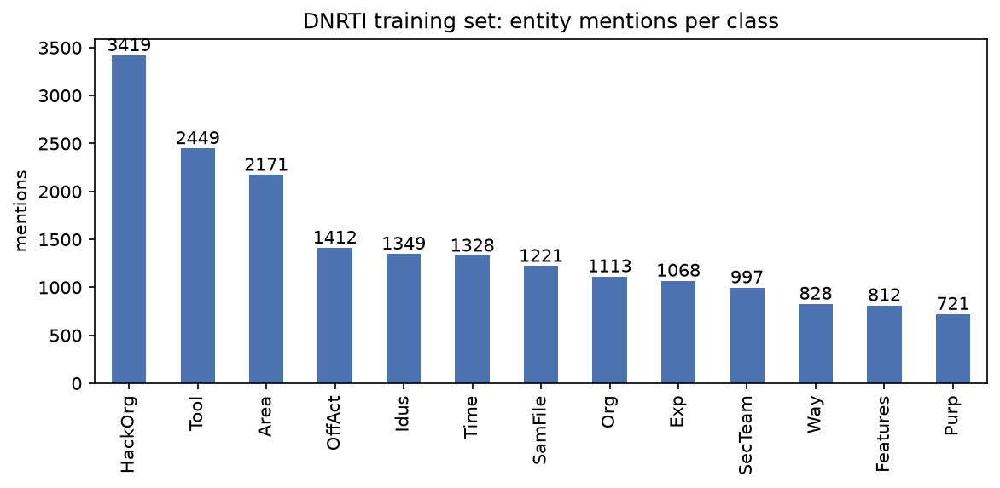
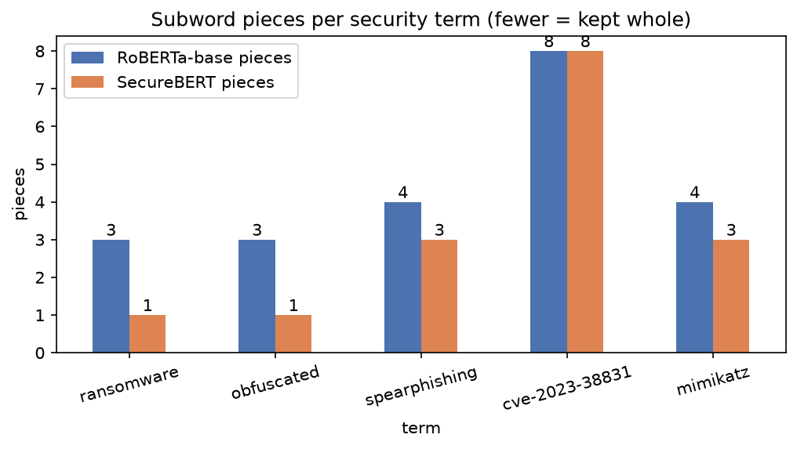
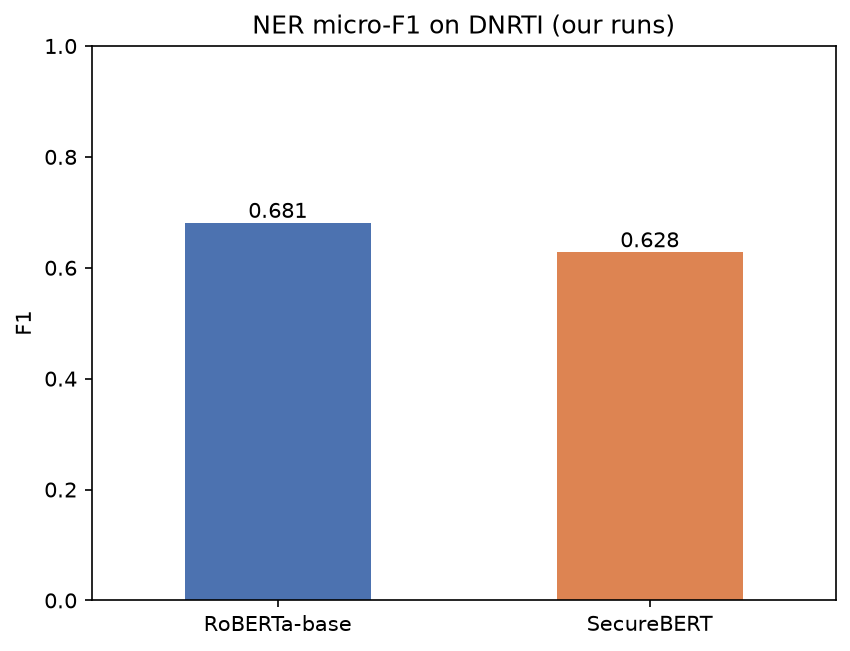
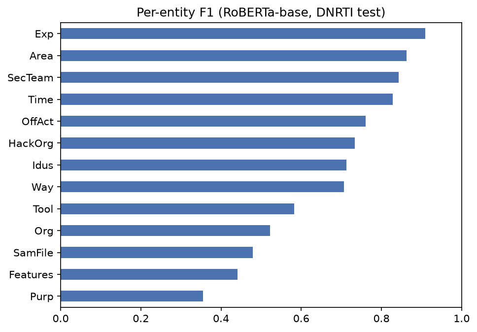
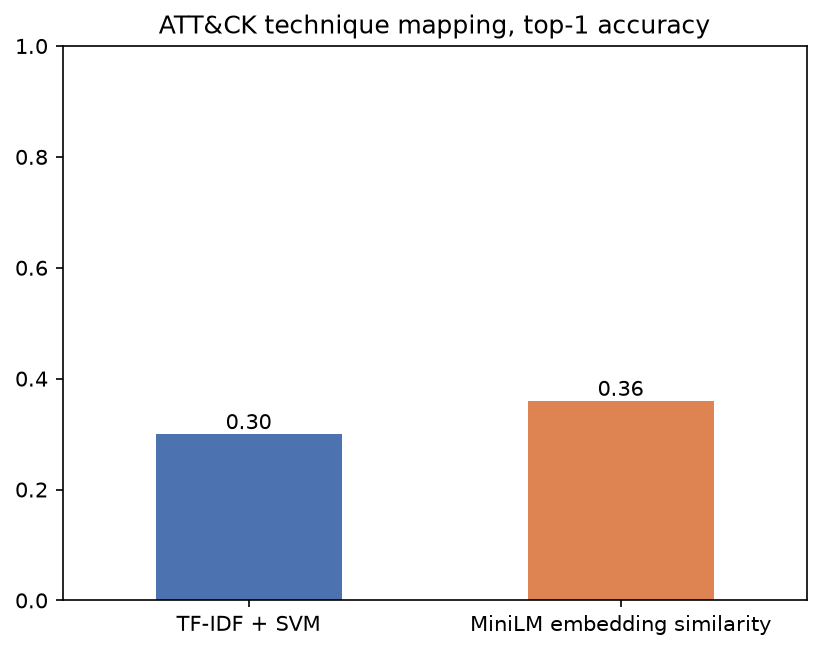
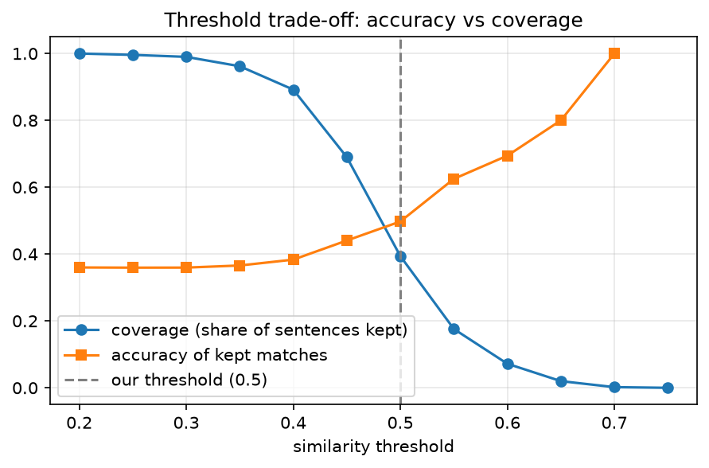
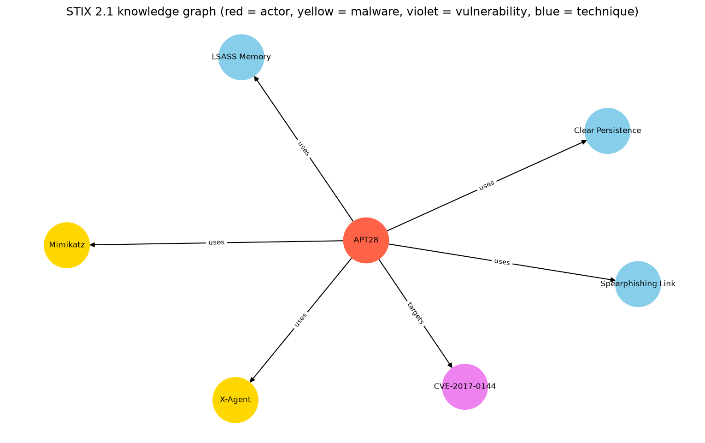

# Cyber Threat Intelligence Extraction using NLP: Implementation Notebook

**B.Tech Project Group 51, Cyber Security Case Study**
Ayaan Rukadikar, Viraj Sheoran, Chintan Pradhan, Deep Shah

A single Jupyter notebook that implements a **scaled-down demonstration** of the pipeline in our case study report, *"Cyber Threat Intelligence Extraction using Natural Language Processing: A Systematic Architecture, Literature Review, and Empirical Benchmark Study"*. It shows one working, measurable example of each major stage of the report's architecture. It does not reproduce every number in the report.

```
DNRTI data ──► Tokenizer study ──► NER fine-tuning (RoBERTa vs SecureBERT) ─┐
MITRE ATT&CK ──► Technique mapping (SVM vs embeddings) ────────────────────┤
                                                                            ▼
                                            STIX 2.1 bundle ──► Knowledge graph ──► Summary
```

## 1. Scope and design principles

The report describes a full-stack system: multi-layer web crawling, a six-stage NLP pipeline, multi-model benchmarks on 4x A100 GPUs and a four-step LLM verification pipeline. We built this notebook on a **MacBook Air M4 (16 GB, Apple MPS GPU)** with **no LLM API access** and a short time budget, so we kept the stages that carry the report's core argument and simplified the rest.

| Principle | Reason |
|---|---|
| One stage = one visible output | Every report section has evidence in the notebook |
| Real public data only | DNRTI and MITRE ATT&CK are datasets the report itself cites |
| Report our own measured numbers | Our results sit beside the paper's cited ones, never copied |
| State every simplification | A simplified step is labeled as such, never presented as the full method |

## 2. Requirements

- macOS on Apple Silicon (tested on a MacBook Air M4, 16 GB). Other machines work if you change the device line in the setup cell (`mps` to `cuda` or `cpu`)
- Python 3.11 or newer (tested on 3.14)
- About 3 GB free disk and an internet connection for the first run
- No API key and no GPU server

## 3. How to run

### 3.1 One-time setup (terminal)
```bash
mkdir -p ~/Desktop/cti && cd ~/Desktop/cti
python3 -m venv venv && source venv/bin/activate
pip install torch transformers accelerate seqeval scikit-learn sentence-transformers \
    stix2 networkx matplotlib pandas requests jupyterlab ipywidgets ipykernel
python -m ipykernel install --user --name cti-venv --display-name "CTI venv"
export PYTORCH_ENABLE_MPS_FALLBACK=1
jupyter lab
```
Open the notebook and select the kernel **CTI venv**. The kernel must use the venv, otherwise imports such as `seqeval` fail even though the packages are installed.

### 3.2 Running the notebook
1. Keep the laptop plugged in (training throttles on battery).
2. Choose Kernel, then Restart Kernel and Run All Cells.
3. The first run downloads DNRTI (about 290 KB), the MITRE ATT&CK JSON and the RoBERTa, SecureBERT and MiniLM weights (about 1.1 GB in total).
4. Expected time on the M4 Air: about 3 minutes of training per NER model, plus a few minutes for everything else.
5. NER results are cached in `out/ner_results.json`, so later runs skip training.

### 3.3 Settings you can change (setup cell)
| Setting | Default | Meaning |
|---|---|---|
| `MAX_TRAIN, EPOCHS, MAXLEN, BATCH` | `3000, 2, 128, 16` | NER training size and length. For a fairer comparison use `5430, 5, 128, 16` (about 15-20 min per model) |
| `RETRAIN` | `False` | Set `True` to delete cached NER results and train again |
| `SIM_THRESHOLD` | `0.50` | Minimum cosine similarity to accept a technique match |

### 3.4 Generated files
| Path | Content |
|---|---|
| `data/dnrti/` | Extracted DNRTI train, valid and test files |
| `data/enterprise-attack.json` | MITRE ATT&CK enterprise data |
| `out/ner_results.json` | Cached NER precision, recall and F1 |
| `out/<model>_model/` | Fine-tuned NER checkpoints |
| `out/bundle.json` | STIX 2.1 bundle from the demo report |
| `out/summary.csv` | Our results next to paper-cited values |
| `out/*.png` | Figures used in the notebook and in Section 11 |

### 3.5 Troubleshooting
| Problem | Fix |
|---|---|
| `No module named X` | Wrong kernel. Switch to CTI venv, or run `%pip install X` in a cell, then restart the kernel |
| `unexpected keyword argument 'warmup_ratio'` | Newer `transformers`. The notebook already uses `warmup_steps` |
| DNRTI extraction fails | Run `brew install unar`, then re-run the data cell |
| Out of memory | Set `BATCH = 8` in the setup cell |
| Training too slow | Lower `MAX_TRAIN`, and set `RETRAIN = True` if one model already finished |

## 4. Notebook structure and mapping to the report

| Stage | What it does | Report section | Output |
|---|---|---|---|
| 0 Setup | Config, seeds, device | 4.1, 4.3 | Device = `mps` |
| 1 Data | Downloads and parses DNRTI | 2.1, 4.2 (Tables 6-7) | 5,430 / 680 sentences, class distribution chart |
| 2 Tokenizers | RoBERTa vs SecureBERT subwords | 3.2 (Table 4, Fig. 2) | Table and bar chart |
| 3 NER | Fine-tunes and evaluates both models | 3.3, 4.4, 5.1 (Table 9, Fig. 4) | P / R / F1 table and chart |
| 3b Per-entity | Per-class F1 of the best model | 4.2 (Table 7) | Table and chart |
| 4 ATT&CK data | Loads techniques, builds labeled test set | 2.3, 4.2 | 697 techniques, 500 sentences |
| 5 Technique mapping | TF-IDF+SVM vs embedding similarity | 2.3, 3.4, 5.2 (Table 11) | Accuracy / F1 table and chart |
| 5b Threshold and errors | Accuracy vs coverage sweep, wrong predictions | 3.4, 4.4 | Chart and error table |
| 6 End-to-end demo | NER, mapping, STIX 2.1, knowledge graph | 3.4, 6 (Table 14, Figs. 6-7) | Entities, techniques, `bundle.json`, graph |
| 7 Summary | Our results vs paper-cited values | 5, 8 | Comparison table |

## 5. What we did and why

### 5.1 Data
We used **DNRTI**, the benchmark the report cites for CTI named entity recognition. The repository ships it as a `.rar` archive, so the notebook downloads and extracts it, then parses the token-per-line BIO format (for example `B-HackOrg`). We kept the dataset's own split (5,430 train / 680 test sentences). Its labels (HackOrg, Tool, Exp, Way, Org, Area, Idus, Purp, OffAct and others) follow the 13-category scheme in Section 2.1 of the report.

### 5.2 Tokenizer study
**Why:** the report's central argument is that general tokenizers fragment security terms and that domain-adapted vocabulary fixes this. It is cheap to demonstrate directly.
**Result:** SecureBERT keeps "ransomware" and "obfuscated" as single tokens, while RoBERTa splits each into 3. For "spearphishing" (4 vs 3 pieces) and "mimikatz" (4 vs 3) the gap is small, and for the CVE ID both tokenizers give 8 pieces. So the adaptation is partial, which matches the report's point that only common domain terms were added to the vocabulary.

### 5.3 NER fine-tuning
**Why RoBERTa-base vs SecureBERT:** SecureBERT is RoBERTa-based, so the two share an architecture and tokenizer family. Any difference isolates the effect of domain-adaptive pre-training, which is the report's claim. Training BERT, XLNet, ELECTRA, CySecBERT and SecureBERT 2.0 would not fit the compute budget.

| Setting | Report (Table 8) | Ours | Why |
|---|---|---|---|
| Epochs | 30, early stopping | 2 | Hardware budget |
| Max sequence length | 512 | 128 | Memory and speed on 16 GB |
| Training data | Full | 3,000 sentences (random subset) | Hardware budget |
| Batch size | 12 (+ grad. accumulation) | 16 | Fits in memory |
| Optimizer / LR | AdamW, separate encoder and CRF rates | AdamW, 5e-5 | No CRF layer |
| Warmup | 10% | 10% (as a step count) | Same intent |
| CRF layer | Yes | No (softmax head) | Dropped to save time, listed as future work |
| Precision | Not stated | FP32 | FP16 is unreliable on MPS |

Subword labels follow the standard approach: the first subword of each word carries the label and the rest are masked (-100). Evaluation uses `seqeval` (entity-level micro P/R/F1).

### 5.4 Technique mapping
**Data:** the 697 current MITRE ATT&CK enterprise techniques. For a labeled test set without manual annotation we use MITRE's own **procedure-example sentences** (real descriptions of how a named malware, tool or group uses a technique), each labeled with its technique ID (500 sentences).

**Methods:**
1. **TF-IDF + linear SVM**, the classical baseline from the report's Section 2.3 (rcATT-style), trained only on technique definitions.
2. **MiniLM embedding similarity**, which matches a sentence to the nearest technique definition by cosine similarity. This corresponds to step 3 (candidate generation) of the report's four-step pipeline.

**Why this setup:** training on definitions and testing on real usage sentences recreates the cross-domain generalization problem in Section 5.3 of the report.

### 5.5 End-to-end demo, STIX 2.1 and graph
One short sample threat report runs through the pipeline:
1. NER with the better of the two fine-tuned models (chosen by F1).
2. Technique mapping by embedding similarity, with a threshold so weak matches show as "no match".
3. Entity cleanup: generic actor words ("group", "attackers") are filtered, and CVE IDs are taken by regex, a standard IoC-extraction approach, because subword NER splits them.
4. STIX 2.1 export with the `stix2` library: threat-actor, malware, vulnerability and attack-pattern objects plus `uses` and `targets` relationships, saved to `out/bundle.json` and validated by parsing it back.
5. Knowledge graph drawn with networkx.

Relationships are **rule-based and document-level**: every actor is linked to every tool and technique found. This is a simplification, not true relation extraction.

## 6. Results

| Metric | Our result | Paper-cited |
|---|---|---|
| NER micro-F1, RoBERTa-base (DNRTI) | 0.681 | 0.842 |
| NER micro-F1, SecureBERT (DNRTI) | 0.628 | 0.945 (SecureBERT 2.0) |
| TTP macro-F1, TF-IDF + SVM | 0.177 (top-1 acc 0.30) | 0.609 |
| TTP macro-F1, MiniLM similarity | 0.212 (top-1 acc 0.36, top-5 0.596) | no equivalent |
| Multi-step LLM pipeline | not implemented | 0.8228 |

**Interpretation**
- Embedding similarity beats TF-IDF+SVM, as in the report.
- SecureBERT scored below RoBERTa-base in our run, which does **not** reproduce the report's ordering. Its training loss was still falling after 2 epochs, so we attribute this to under-training on a subset, not to a flaw in domain adaptation. This is a limitation of our setup, not evidence against the paper.
- TTP scores are far below the paper's because we choose among 697 labels on a different text style, and the SVM never sees real report language. This reproduces the cross-domain degradation described in Section 5.3 of the report.

If you rerun NER with the larger settings, update the NER numbers and the SecureBERT sentence above.

## 7. Differences from the report

| Aspect | Report | This notebook |
|---|---|---|
| Hardware | 4x A100 (80 GB) | MacBook Air M4 (MPS) |
| Data collection | Clear, deep and dark web crawling | None; one hand-written sample report |
| NER models | BERT, XLNet, RoBERTa, ELECTRA, CySecBERT, SecureBERT 2.0 | RoBERTa-base and SecureBERT |
| NER training | 30 epochs, max length 512, CRF layer | 2 epochs, max length 128, softmax head |
| TTP pipeline | 4 steps including LLM verification | Embedding similarity plus a threshold |
| Relation extraction | Part of the pipeline | Rule-based actor links |
| Knowledge graph | Neo4j | networkx |

**Not implemented (future work):** web crawling (legal and ethical risk, and no benefit for a demo), CRF decoding layer, the other language models, AttackER / TRAM / WAVE-27K benchmarks, LLM verification and atomic behavior extraction (needs an LLM API), model-based relation extraction, Neo4j storage, XAI and adversarial robustness experiments.

## 8. Known limitations

- Absolute scores are not comparable with the paper's because of reduced training, a data subset and different test sets.
- The demo report is short and hand-written, so the end-to-end output shows the mechanism and not benchmark-level quality.
- Embedding-based mapping can pick related but wrong techniques (for example, "registry modification for persistence" matched "Clear Persistence"). This is the problem the paper's LLM verification step addresses.
- Some values in the case study report have not been independently verified (see Section 10).

## 9. Reproducibility

Random seeds are fixed (42). Trained NER checkpoints and metrics are saved in `out/`, so re-running the notebook does not retrain unless `RETRAIN = True`. The notebook was verified with Kernel, Restart and Run All.

## 10. Data provenance and verification status

We separate three kinds of numbers so it is clear what we measured and what we only cite.

### 10.1 Measured by us (this notebook)
NER F1, TTP results, tokenizer splits and dataset sizes (5,430 / 680 sentences, 697 techniques, 500 test sentences). They are reproducible from the notebook and the cached files in `out/`.

### 10.2 Quoted from cited work (not reproduced by us)
We report these as published by their authors and did not re-run them.

| Value | Source ref. | Verification status |
|---|---|---|
| DNRTI baselines (XLNet 0.883, BERT 0.875, RoBERTa 0.842, ELECTRA) | 12 | Cited from ref 12; not independently re-verified |
| SecureBERT results | 4 | Cited from ref 4; not independently re-verified |
| 82.28% multi-step LLM pipeline | 8 | Cited from ref 8; not independently re-verified |
| TTPrint 76.48% | 24 | Cited from ref 24; not independently re-verified |
| Cross-domain drop 86.37% to 38.05% | 8, 15 | Cited from refs 8 and 15; not independently re-verified |
| rcATT / TF-IDF+SVM 0.609 | 19 | Cited from ref 19; not independently re-verified |
| DNRTI entity counts (report Table 7) | 12 | Cited from ref 12; not compared with the dataset files |

### 10.3 Values needing caution
- **SecureBERT 2.0 and CySecBERT rows in the report's Table 9:** no direct citation for the exact precision and recall values.
- **Figure 4 vs Table 9:** Figure 4 shows SecureBERT 2.0 at 86.5 F1 while Table 9 gives 0.945, so the two cannot both be right.
- **Abstract claim:** "no false positives" for the LLM pipeline conflicts with the reported precision of 0.841.
- **DistilBERT row in Table 13:** 82.10% with a "40.90% drop" is ambiguous, because 82.10 minus 40.90 is 41.20, so it is unclear whether 40.90 is the drop or the resulting score.
- **Table 5 hardware and Table 8 hyperparameters:** attributed to references, but not confirmed to be reported there.

Where a value could not be confirmed, treat it as unverified and do not rely on it as evidence.

## 11. Figures

| Class distribution | Tokenizer pieces | NER F1 |
|---|---|---|
|  |  |  |

| Per-entity F1 | Technique mapping | Threshold trade-off |
|---|---|---|
|  |  |  |

